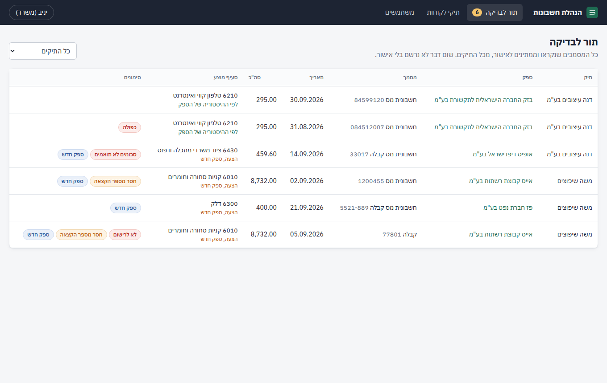
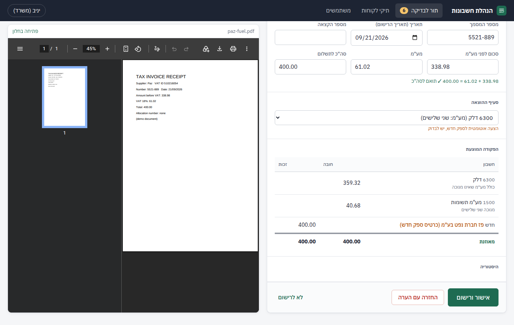

# מערכת הנהלת חשבונות

מערכת למשרד הנהלת חשבונות: הלקוח מעלה חשבוניות הוצאה מהטלפון או מהמחשב, המערכת קוראת אותן אוטומטית ומכינה פקודת יומן מוצעת, ואיש המשרד בודק ומאשר. שום דבר לא נרשם בלי אישור.



## מה יש בפנים

- **לקוח** (טלפון או מחשב): מצלם או בוחר כמה חשבוניות בבת אחת (PDF או תמונה), ורואה ליד כל מסמך את המצב שלו: התקבל, ממתין לבדיקה, נרשם, הוחזר עם הערה. לקוח רואה רק את התיק שלו.
- **קריאה אוטומטית**: מכל מסמך נקראים שם הספק ומספר העוסק, סוג המסמך, מספרו ותאריכו, הסכום לפני מע"מ, המע"מ, הסה"כ ומספר ההקצאה.
- **פקודה מוצעת**: חובה הוצאה וחובה מע"מ תשומות, זכות ספק. סעיף ההוצאה הוא הסעיף שאושר בפעם האחרונה לאותו ספק; ספק חדש מקבל סעיף מוצע ומסומן "ספק חדש".
- **תור לבדיקה** אחד לכל התיקים, ומסך בדיקה שבו המסמך מוצג ליד הפקודה: אישור, תיקון ואישור, החזרה ללקוח עם הערה, או "לא לרישום".
- **ספרים לכל תיק**: אינדקס חשבונות מוכן שאפשר לערוך, כרטיסי ספקים, יומן, וכרטסת עם יתרה מצטברת.
- **יומן פעולות**: כל פעולה נשמרת עם מי ומתי, ואי אפשר לערוך או למחוק אותו.



## הכללים שהמערכת אוכפת

| כלל | איך |
|---|---|
| שום דבר לא נרשם בלי אישור | פקודה נכתבת ליומן רק בלחיצה על "אישור ורישום" |
| חשבונית כפולה | אותו ספק (לפי מספר עוסק) ואותו מספר מסמך: אם כבר נרשמה, האישור חסום; אם השנייה עוד ממתינה, מופיעה אזהרה |
| סכומים לא תואמים | סה"כ שונה מסכום + מע"מ: האישור חסום עד שמתקנים |
| מספר הקצאה חסר | מעל 5,000 ש"ח לפני מע"מ מתאריך 1.6.2026, ומעל 10,000 ש"ח עד 31.5.2026: אזהרה |
| מע"מ | 18%. סטייה מ-18% מסומנת כאזהרה |
| ניכוי מע"מ לפי סעיף | מלא כברירת מחדל; שני שלישים לרכב ולטלפון (תקנה 18); רבע וללא ניכוי זמינים לבחירה. החלק שאינו מנוכה נכנס להוצאה |
| תאריך הרישום | תאריך החשבונית |
| פקודה רשומה | לא נמחקת ולא נערכת (נאכף גם במסד הנתונים). תיקון = פקודת ביטול הפוכה + פקודה חדשה |
| סוגי מסמכים | נרשמות רק חשבונית מס וחשבונית מס קבלה; כל מסמך אחר מסומן "לא לרישום" |
| זיהוי ספק | לפי מספר העוסק. כרטיס ספק (21001 ואילך) נפתח עם אישור החשבונית הראשונה שלו |

לא כלול בגרסה הזו: הכנסות, דוחות מע"מ ומס, מאזן ורווח והפסד, תשלומים, התאמות בנק, וואטסאפ ומייל, ייצוא.

## הרצה

צריך Node.js בגרסה 22.13 ומעלה. אין צורך במסד נתונים חיצוני: הנתונים נשמרים בקובץ SQLite בתיקייה `data/`, והקבצים שהועלו ב-`data/uploads/`.

```bash
npm install
npm run create-user -- --email office@example.co.il --name "יניב" --role staff
npm start
```

ואז פותחים `http://localhost:3000`.

### משתמשים

- איש משרד: `npm run create-user -- --email ... --name ... --role staff`
- לקוח: `npm run create-user -- --email ... --name ... --role client --client "שם העסק" --tax-id 515000008`
  (אם אין עדיין תיק בשם הזה, הוא נפתח עם אינדקס החשבונות המוכן)
- הסיסמה נשאלת בהרצה, או נלקחת ממשתנה הסביבה `PASSWORD`.
- אחרי הכניסה, אנשי המשרד מוסיפים תיקים, משתמשי לקוח ואנשי משרד מתוך המערכת עצמה.

### נתוני הדגמה

על מסד נתונים ריק:

```bash
npm run demo
npm start
```

נכנסים עם הסיסמה `demo1234` בתור `office@demo.local` (משרד), `dana@demo.local` או `moshe@demo.local` (לקוחות). בתור יש דוגמה לכל סימון: ספק חוזר שקיבל את הסעיף מההיסטוריה, חשבונית כפולה, סכומים שלא מסתדרים, מספר הקצאה חסר, דלק עם ניכוי שני שלישים, וקבלה שלא נרשמת. כדי להתחיל מחדש מוחקים את התיקייה `data/`.

### משתני סביבה

| משתנה | מה הוא עושה | ברירת מחדל |
|---|---|---|
| `ANTHROPIC_API_KEY` | המפתח לקריאת החשבוניות. נשמר בכספת של הפרויקט בשם הזה, ומשם מוזן לשרת. בלעדיו מסמכים מגיעים לתור בלי קריאה ומוקלדים ידנית | אין |
| `PORT` | הפורט של השרת | `3000` |
| `DATA_DIR` | איפה נשמרים מסד הנתונים והקבצים | `./data` |
| `COOKIE_SECURE` | `1` כשהשרת מאחורי HTTPS (חובה בייצור) | כבוי |
| `EXTRACTION_MODEL` | המודל שקורא את החשבוניות | `claude-opus-5-5` |
| `EXTRACTION_EFFORT` | רמת המאמץ של הקריאה | `low` |
| `WORKER_ENABLED` | `0` מכבה את הקריאה האוטומטית (לבדיקות) | פעיל |

### בדיקות

```bash
npm test
```

הבדיקות מכסות את כללי הרישום (פיצול מע"מ, ספי מספר הקצאה, כפולות, סכומים, סוגי מסמכים), את הספרים (רישום מאוזן, נעילת פקודות, ביטול ותיקון, ספר חוזר מקבל אותו סעיף) ואת ההפרדה בין לקוחות.

## איך זה בנוי

- `src/server.js`: נקודת הכניסה. מפעיל את השרת ואת התהליך שקורא מסמכים ברקע.
- `src/app.js`: כל ה-API וההרשאות (משרד רואה הכל, לקוח רק את התיק שלו).
- `src/books.js`: אישור ורישום, ביטול, יומן, כרטסת, ספקים.
- `src/rules.js`: הכללים כפונקציות טהורות: מע"מ, ספים, סימונים, בניית הפקודה.
- `src/extract.js` ו-`src/worker.js`: קריאת החשבונית במודל שמבין תמונות ו-PDF, עם עד 3 ניסיונות. מסמך שלא נקרא מגיע לתור עם הסימון "לא נקרא אוטומטית".
- `src/db.js`: מבנה הנתונים. סכומים נשמרים באגורות שלמות; טריגרים חוסמים עריכה ומחיקה של פקודות ושל יומן הפעולות.
- `public/`: הממשק, בעברית ומימין לשמאל, בלי שלב בנייה. תמונות מהטלפון מוקטנות בדפדפן לפני ההעלאה.

## הנחות שנלקחו

- הספרים (אינדקס, ספקים, יומן, כרטסת) גלויים לאנשי המשרד בלבד; הלקוח רואה את המסמכים שלו והמצב שלהם.
- ברירות המחדל באינדקס: שני שלישים ניכוי מע"מ לטלפון, לאינטרנט ולרכב, וללא ניכוי לאירוח ומתנות. הכל ניתן לשינוי בלשונית "אינדקס חשבונות".
- סף מספר ההקצאה של 10,000 ש"ח חל על כל חשבונית מתאריך שלפני 1.6.2026.
- הקריאה האוטומטית היא הצעה בלבד: כל שדה ניתן לתיקון במסך הבדיקה, והתיקון נרשם ביומן הפעולות.
